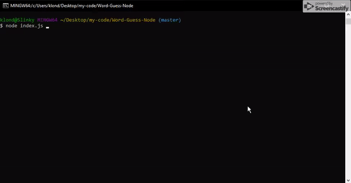

# Word-Guess-Node

Hangman in the terminal; a node application and example of constructor functions!

## Installing

Once you've cloned the repository, you'll need to install the required node packages listed in packages.json. This is done with a simple npm install command.

Run with 'node index.js' and you'll be given a random animal name to guess the characters of. Strike out 10 times and it's game over, but you can always play again.

## Built With
* Javascript
* Node
* Inquirer

## Authors

* **Andrew Meyer** - *Initial work* - [Andypants152](https://github.com/Andypants152)